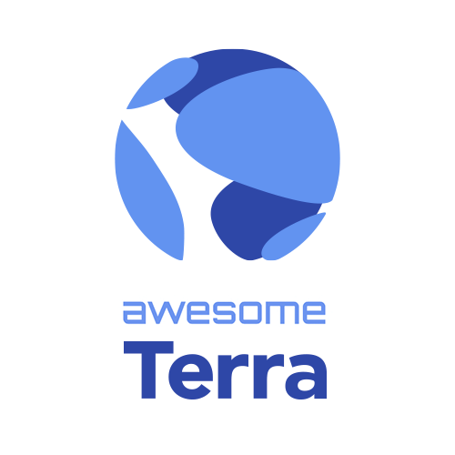

  

A curated list of useful resources related to the [Terra](https://terra.money) blockchain.

Terra is an open-source blockchain project that focuses on mass-user adoption and infrastructure for decentralized finance and payments solutions.

## Table of Contents <!-- omit in toc -->

- [Documentation](#documentation)
- [Applications](#applications)
- [Block Explorers](#block-explorers)
- [Development Tools](#development-tools)
  - [SDKs](#sdks)
  - [Smart Contracts](#smart-contracts)
  - [Testing](#testing)
  - [Infrastructure & Indexers](#infrastructure--indexers)
- [Wallets](#wallets)
- [Contribute](#contribute)

## Documentation

- [Terra Docs](https://docs.terra.money) - Official Terra documentation
- [Whitepaper](https://terra.money/Terra_White_paper.pdf) - Latest Terra whitepaper
- [Agora](https://agora.terra.money) - Research forum for the development of Terra

## Applications

Applications with large-scale adoption, powered by Terra

- [CHAI](https://chai.finance) - Payment gateway with 2m+ users operating in SEAsia providing discounts from seigniorage
- [memeChat](http://memechat.mn/) - Payment gateway in Monogolia using TerraMNT

## Block Explorers

- [Terra Finder](https://finder.terra.money) - Official block explorer by Terraform labs
- [StakeID](http://terra.stake.id/) - block explorer for Terra by Staking Fund
- [Figment Hubble](https://hubble.figment.io/terra/chains/columbus-4) - block explorer by Figment

## Development Tools

### SDKs

- [Terra.js](https://github.com/terra-project/terra.js) - JavaScript SDK for Terra
- [Terra.py](https://terra-money.github.io/terra.py/) - Python SDK for Terra

### Smart Contracts

- [Houston](https://github.com/terra-project/houston) - Terra Smart Contract development toolchain

### Testing

- [LocalTerra](https://github.com/terra-project/LocalTerra) - Local, configurable one-click testnet for Terra

### Infrastructure & Indexers

- [FCD](https://github.com/terra-project/fcd) - Indexer that powers core Terra Finder and Terra Station
- [Mantle](https://github.com/terra-project/mantle) - A set of default indexers for Terra, powered by Mantle-SDK
- [Mantle-SDK](https://github.com/terra-project/mantle-sdk) - Framework / subsystem for writing indexers for Terra blockchain

## Wallets

- [Terra Station](https://station.terra.money/) - Web / Desktop wallet, by Terraform Labs
- [Lunie](https://lunie.io/) - Staking-focused wallet with mobile support
- [ZenGo](https://zengo.com/) - User-friendly and secure mobile crypto wallet with Terra support

## Contribute

Contributions welcome! Read the [contribution guidelines](contributing.md) first.
